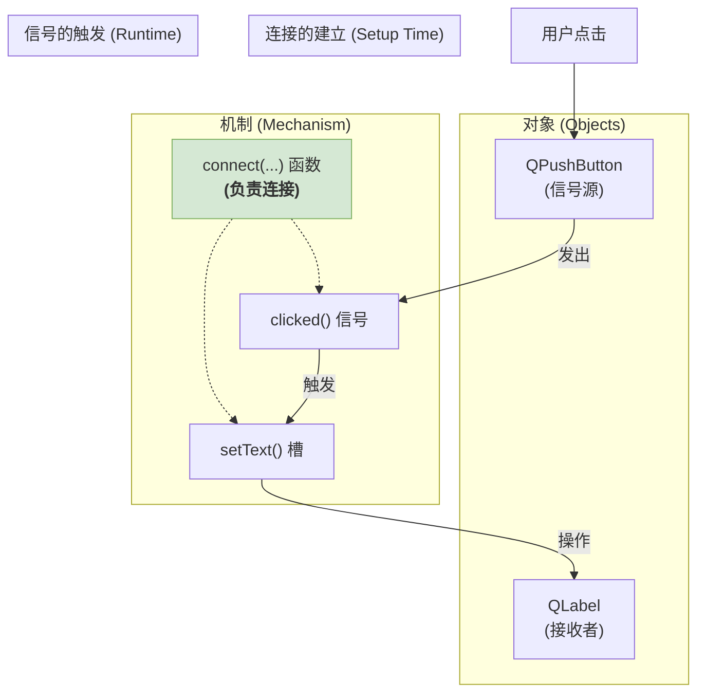
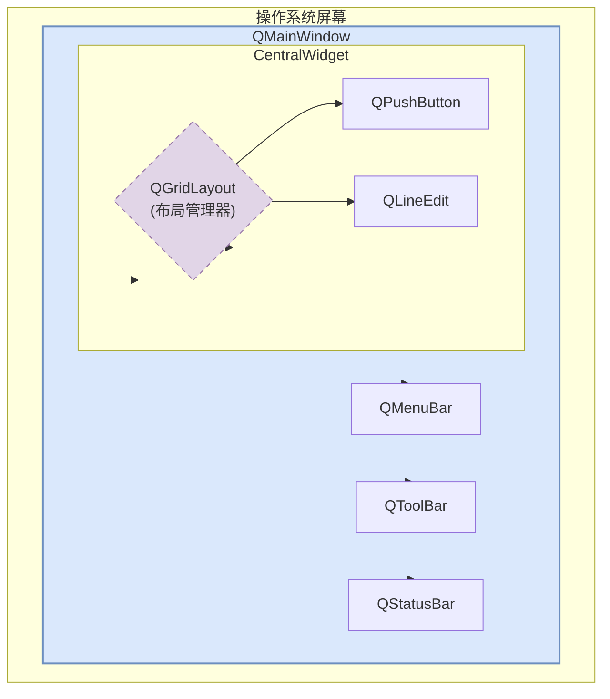
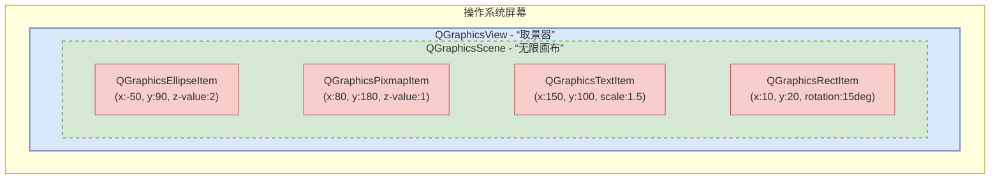
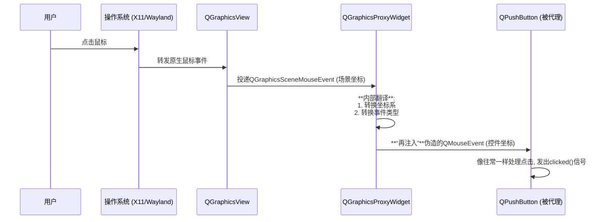
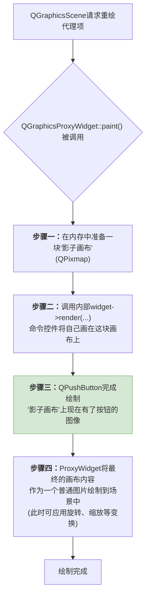
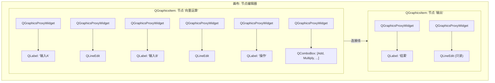

# 解析QGraphicsProxyWidget的桥接作用

`Qt`是一个用于构建图形用户界面(GUI)和跨平台应用程序的“超级工具箱”。`Qt`提供了一套标准化的”零件“，只需要用这些零件组装一次，应用程序就能在所有主流的操作系统上运行。

在我们深入今天的主题之前，对于初次接触Qt的同学，理解其设计的“三大基石”至关重要。

## Qt的三大基石

### QObject

在`Qt`中，几乎所有有意义的对象(窗口、按钮、定时器等)都继承自**`QObject`**这个始祖类。`QObject`之所以如此特别，是因为它是通往Qt**元对象系统（Meta-Object System）**的大门。

**元对象系统是什么？** 你可以把它想象成每个`QObject`都随身携带的一张详细的“身份信息卡”。这张卡片不是C++原生就有的，而是Qt通过一个名为**MOC（Meta-Object Compiler）**的预处理器工具，在编译前为你的代码自动生成的。这张“身份卡”上记录了：

- 对象的类名是什么（`className()`）。
- 它能发出哪些**信号**。
- 它有哪些可供调用的**槽函数**。

正是因为有了这张预先生成好的“信息卡”，Qt才能够在程序运行时，动态地查询对象的信息，并实现下面要讲的、极其灵活的信号与槽通信机制。

### 信号与槽(singal & Slots)

这是Qt框架的灵魂，是一种无与伦比的对象间通信机制。让我们用一个生活中的例子来理解它：

- **传统方式（函数调用）：** 你按下一个电灯开关，开关必须**明确知道**灯泡在哪里，并且调用灯泡的`turnOn()`方法。开关和灯泡“耦合”得非常紧，换个灯泡可能就要改动开关的“接线”。
- **Qt的方式（信号与槽）：**
  - 一个`QPushButton`（按钮）被点击时，它不会去找具体要干什么事的对象，它只是向外大喊一声：“**我被点击了！**”（这就是**信号 `clicked()`**）。
  - 而另一个对象，比如一个窗口，有一个“耳朵”在听，这个耳朵就是**槽函数**（例如`handleButtonClick()`）。
  - 我们只需要一行代码 `connect(button, &QPushButton::clicked, window, &MyWindow::handleButtonClick);` 就建立了一条“连接”。

从此，按钮只管发出信号，窗口只管接收并处理。它们彼此完全独立，一个按钮的点击信号可以连接到多个槽，一个槽也可以接收来自多个信号。这种**“解耦”**的设计是构建复杂、可维护UI的基石。

### 事件循环(The Event Loop)

GUI程序和命令行程序不同，它不会从头执行到尾然后退出。它必须一直运行，等待用户的操作。这就是**事件循环**的职责。

把它想象成一个**兢兢业业的前台接待员** (`QApplication::exec()`)：

1. **等待：** 接待员坐在那里，循环等待。没有事情发生时，程序就“打个盹”，不消耗CPU。
2. **事件：** 一个“事件”发生了（比如，一位访客到来，代表用户的一次鼠标点击）。
3. **分发：** 接待员看到访客的预约单，上面写着“找三楼的按钮经理”，于是他把访客（事件）**引导**给了正确的对象（那个被点击的按钮）。
4. **处理：** “按钮经理”处理完访客的事务（比如发出`clicked()`信号），然后告诉接待员“我处理完了”。
5. 接待员回到座位，继续等待下一个事件。

这个“等待-分发-处理”的循环，就是所有GUI应用能够灵敏响应我们操作的核心机制。

## “组建集”与“画布”

在Qt中，构建用户界面的两个体系是`QWidget`(控件)体系和`QGraphicsView`(场景)体系。首先我们需要知道`QGraphicsProxyWidget`为和存在。

### QWidget体系

`QWidget`是我们最先接触，也是最常用的UI构建方式。它的核心思想是**“组件集（Component Set）”**，我们可以将其比作一个**结构严谨、等级分明的“城市”**。

- **核心单元与父子关系：** 这个“城市”的基本建筑单元是`QWidget`及其子类（`QPushButton`, `QLineEdit`等）。它们之间存在着严格的**父子关系**。子控件（child widget）在视觉上被“框”在父控件（parent widget）的矩形区域内，无法超出。当父控件被移动、隐藏或销毁时，其所有子控件也会随之移动、隐藏或销毁。这种层级关系构成了UI的骨架。
- **布局管理（Layouts）：** 为了让“城市”的建筑排列整齐，`QWidget`体系引入了**布局管理器**（`QLayout`的子类，如`QVBoxLayout`, `QHBoxLayout`, `QGridLayout`）。布局管理器如同城市的“规划局”，它接管了其内部所有控件的尺寸和位置。你只需要告诉“规划局”需要放入哪些控件，以及一些基本规则（如间距、对齐方式），它就会自动计算每个控件的最佳大小和位置，并在窗口尺寸变化时智能地重新调整布局，确保UI的响应式和美观。
- **事件处理（Event Handling）：** `QWidget`的事件处理是**“直接分发”**的。在Linux上，每个顶层`QWidget`都是一个受窗口管理器管理的**原生窗口**，拥有独立的窗口句柄。当操作系统捕获到一个鼠标点击或键盘输入时，它能根据事件发生的屏幕坐标，准确地判断出事件属于哪个原生窗口。该事件随后被Qt的事件循环接收，并几乎直接地派发给目标`QWidget`。控件通过重写虚函数（如`mousePressEvent()`, `keyPressEvent()`, `paintEvent()`）来响应这些事件。
- **绘制模型（Painting Model）：** 其绘制模型是**“独立且光栅化”**的。每个`QWidget`都拥有一块独立的内存区域，称为“后备存储（Backing Store）”。当需要重绘时（由`paintEvent`触发），每个控件只负责绘制自己矩形区域内的像素。最终，由窗口系统或父控件将这些独立的绘制结果**合成（Composite）**在一起，形成我们看到的完整窗口。

### QGraphicsView体系

与`QWidget`的严谨不同，`QGraphicsView`提供了一个极其自由、动态的创作环境，其核心思想是**“画布（Canvas）”**或**“场景图（Scene Graph）”**。我们可以将其比作一个**拥有“上帝视角”的数字创作空间**。

这个世界由三个核心组件构成：

1. **`QGraphicsScene` (场景 - 逻辑世界):**
   - 这是“无限大的宇宙”或“数据模型”。它是一个逻辑容器，容纳着成千上万个图形项（`QGraphicsItem`）。
   - 场景本身不关心如何被显示，它只负责管理所有item的**逻辑坐标、状态和层次关系**。它使用高效的空间索引算法（如BSP树），能够飞快地查询到特定区域内有哪些item。
2. **`QGraphicsView` (视图 - 观察窗口):**
   - 这是我们观察场景的“摄像机”或“取景器”。它是一个标准的`QWidget`，也是整个体系中唯一与操作系统直接交互的原生窗口。
   - 它的核心职责是将`QGraphicsScene`中的矢量坐标**映射**到它自己的像素坐标上，并将用户的鼠标、键盘事件**翻译**后传递给场景。
   - 最强大的一点是，**同一个场景可以被多个视图观察**。你可以创建两个视图，一个显示场景的全貌（如地图），另一个则放大显示场景的某个局部细节（如街道），并且在一个视图中对item的修改会立刻反映在另一个视图中。视图本身还可以旋转和缩放，如同调整摄像机的角度和焦距。
3. **`QGraphicsItem` (图形项 - 世界居民):**
   - 这些是场景中的“演员”或“居民”，是构成视觉内容的基本单元。它们是**轻量级**的，因为它们没有自己的窗口句柄或事件循环。
   - 每个`QGraphicsItem`都知道如何绘制自己（通过`paint()`方法）、自己的边界范围（`boundingRect()`）以及精确形状（`shape()`，用于碰撞检测）。
   - 它们可以被自由地**移动、缩放、旋转、扭曲**，可以被组合成复杂的复合体，并且拥有Z值来控制其堆叠顺序。

- **事件处理（Event Handling）：** `QGraphicsView`的事件处理是**“间接且由场景驱动”**的。所有原生事件首先被`QGraphicsView`接收。然后，视图会询问场景：“鼠标在`(x, y)`这个像素位置，对应到你的逻辑世界里是哪个坐标？这个坐标上最顶层的item是谁？”场景利用其高效的索引找到目标item后，`QGraphicsView`再将事件分发给这个item。整个过程由Qt在应用程序内部完成，操作系统对此一无所知。
- **渲染模型（Rendering Model）：** 其渲染是**“集中式”**的。`QGraphicsView`是唯一的“渲染引擎”。在需要重绘时，它会根据当前的视口范围，要求场景提供所有可见的item列表，然后按照Z值顺序遍历这些item，并调用它们的`paint()`方法，将它们统一绘制到自己的视口上。这个过程可以无缝地切换到**OpenGL/Vulkan后端**，利用GPU进行硬件加速，从而在渲染大量动态对象时保持极高的流畅度。

## 桥梁(QGraphicsProxywidget)

现在，我们已经深刻理解了这两个世界的根本不同：

- **`QWidget`体系**：一个由拥有独立“户口”（窗口句柄）的“公民”构成的社会，秩序井然，但缺乏灵活性。
- **`QGraphicsView`体系**：一个由没有“户口”的“虚拟灵魂”构成的魔法世界，自由奔放，但缺少现成的、功能丰富的“公民”。

**核心矛盾也因此凸显**：如何将一个功能完备的`QWidget`“公民”，请到`QGraphicsScene`这个魔法世界里来，并让它在这里依然能行动、能交互，享受缩放和旋转的“魔法”？

这就是`QGraphicsProxyWidget`需要登场的原因。它，就是为了连接这两个平行宇宙而生的**“次元之桥”**。

### 核心翻译机制

`QGraphicsProxyWidget`的桥接作用并非魔法，而是一套精密的、在用户空间实现的“合成器”，其核心是两大翻译机制。

**事件流的捕获与"再注入"**

一个控件不仅要能看，还要能用。`QGraphicsProxyWidget`通过一个巧妙的事件重定向流程保证了交互性。

如上图所示，`QGraphicsProxyWidget`像一个海关，它“拦截”了来自`QGraphicsScene`的事件，经过一番“翻译”和“伪装”后，再“注入”给它所代理的`QWidget`。被代理的控件对此毫无察觉，以为自己生活在普通的窗口环境中。

**绘制机制的重定向**

`QGraphicsProxyWidget`采用了“离屏渲染”的技术，让`QWidget`在不知情的情况下将自己画在一张“影子画布”上。

这个过程，`QGraphicsProxyWidget`像一个技艺高超的画家，它先让`QWidget`在一张不对外展示的画纸上画好自画像，然后它再拿起这张画，进行艺术加工（变换），最后贴到`QGraphicsScene`这个大展板上。

**构建强大的UI**

掌握了`QGraphicsProxyWidget`，我们就能构建出许多传统`QWidget`布局难以实现的复杂UI。最典型的就是**节点编辑器**。

### “过路费”

这套精密的机制并非没有代价。

- **内存开销**：每个`QGraphicsProxyWidget`都需要一块`QPixmap`作为“影子画布”。如果你的场景中有成千上万个复杂的代理控件，这部分内存占用会相当可观。
- **CPU开销**：相比于一个只执行简单绘图命令的`QGraphicsItem`，代理项的`QWidget::render()`调用（本质上是软件光栅化）和频繁的事件翻译都会带来额外的CPU开销。

因此，`QGraphicsProxyWidget`是一个“大杀器”，而不是“常规武器”。**如果一个功能可以通过自定义一个轻量级的`QGraphicsItem`来实现，那么就优先选择它**。只有当你需要嵌入一个功能极其复杂、如果重写为`QGraphicsItem`则成本过高的现有`QWidget`时，`QGraphicsProxyWidget`才是你的最佳选择。

## 总结

从始至终，`QGraphicsProxyWidget`的核心使命就是：在两个不同就阿狗的图形与时间系统之间，充当一个高性能的**实时翻译官**和**用户空间合成器**。

1. **绘制重定向（Painting Redirection）**：`QGraphicsProxyWidget` 通过接管被代理`QWidget`的绘制目标，将其从屏幕的“后备存储”重定向到一块内存中的“离屏画布”（`QPixmap`）。它巧妙地利用 `QWidget::render()` 函数，命令控件在这块“影子画布”上完成所有绘制。随后，它再将这张已经画好的、光栅化的位图作为一张普通的纹理，绘制到`QGraphicsScene`的最终渲染目标上。这个过程，在应用层面实现了一套独立的**离屏渲染与位图合成（Off-screen Rendering & Blitting）**流程。
2. **事件流重塑（Event Stream Remodeling）**：它在事件传递的路径上设立了一个“检查点”。所有发往其在场景中所在位置的`QGraphicsScene`事件都会被它捕获。它会基于场景图的变换（Transform）信息，将事件的坐标系、类型和参数从`QGraphicsScene`的语境，精确地“翻译”成`QWidget`内部的局部语境，并构造成一个全新的、标准的`QWidget`事件。最后，它通过Qt的事件系统，将这个“伪造”的事件**重新注入（Re-inject）**到被代理控件的事件队列中，从而“欺骗”`QWidget`，使其相信自己正与操作系统直接交互。
3. **几何状态同步（Geometry State Synchronization）**：`QGraphicsProxyWidget`持续监听其内部`QWidget`的尺寸策略（Size Policy）和几何变化。当`QWidget`因内部布局变化而希望改变大小时，代理项会相应地更新自己在`QGraphicsScene`中的边界框（Bounding Rectangle）。反之，当代理项在场景中被用户或动画系统缩放、变形时，它也会将这种几何变换信息传递给内部的`QWidget`，触发其布局的重新计算。这种**双向的几何状态同步**，保证了两个世界在视觉和布局上的一致性。

综上所述，`QGraphicsProxyWidget`并非一个简单的容器，而是一个精密的**运行时适配器（Runtime Adapter）**。它以一定的内存和CPU开销为代价，通过在用户空间模拟`QWidget`的绘制环境和事件来源，实现了在矢量化、可变换的场景图中嵌入和复用功能完备的光栅化组件这一高难度任务，是Qt框架中“组合优于继承”和“适配器模式”的绝佳体现。
